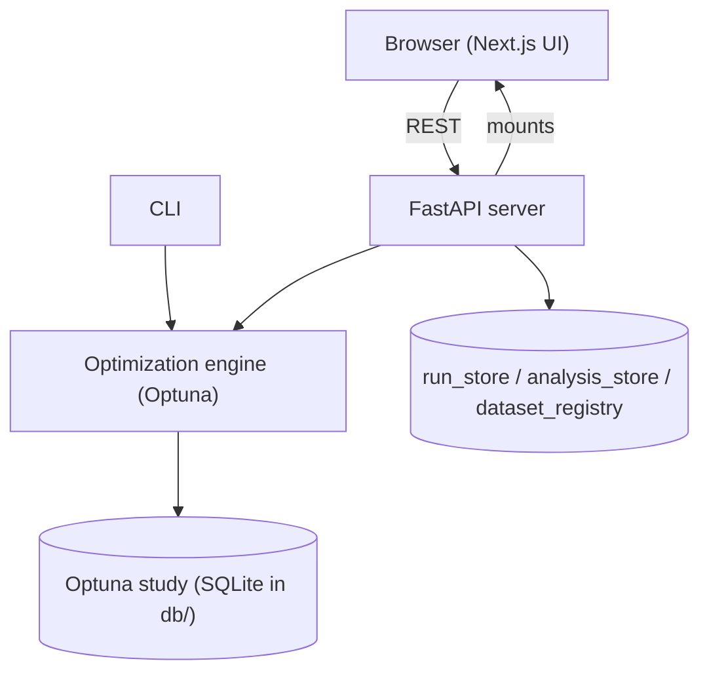

QuOptuna ships as a single Python package, `src/quoptuna/`, that bundles four cooperating layers: a core optimization engine (`backend/`), a FastAPI server (`server/`), a command-line interface (`cli.py`), and a pre-built Next.js static UI (`web/`). A legacy Streamlit dashboard (`frontend/app.py`) is also included as a fallback. This page explains how those pieces relate and how a request flows through them.

## The layers

The **engine** is the heart of the system: an Optuna wrapper that builds a search space, runs trials, scores them, and records results. It knows nothing about HTTP.

The **server** is a thin FastAPI application (`quoptuna.server.main:app`, titled "QuOptuna Next API"). It exposes REST routers, orchestrates runs as background tasks, and manages persistence. It also mounts the compiled Next.js UI at `/` and serves interactive API docs at `/api/docs`.

The **web** UI is a Next.js 15 / React 19 App Router application. The top-level `frontend/` directory holds its dev source; `make build_package` runs `npm run build` and copies `frontend/out` into `src/quoptuna/web`, so a plain `uvx quoptuna` ships the fully-built UI.

The **CLI** drives the same engine headlessly for scripted or reproducible runs.

## Packaged vs dev mode

In **packaged mode**, one uvicorn process serves both the UI and the API on a single port (default 8000) — same origin, no CORS gymnastics for the user. This is what end users get from `uvx quoptuna`.

In **dev mode**, two processes run side by side: FastAPI on `:8000` and the Next.js dev server on `:3000`. The server is CORS-enabled so the separate frontend origin can call it during development.

## Request flow

Starting a run is asynchronous. The browser (or CLI) issues `POST /api/v1/optimize`, and the server launches the optimization as a **FastAPI background task** so the request returns immediately. The engine then writes trials into an Optuna study on disk. The UI polls `GET /api/v1/optimize/{id}/trials` for live progress rather than holding a long connection open.

:::note
Optuna studies live as separate SQLite files under `db/` and are the **source of truth** for trials and best-value. The API re-reads them on each status or detail request, so progress reflects the study itself, not a cached copy.
:::

## Persistence model

Three SQLite stores hold server-side state:

- **`run_store`** — durable optimization-run records. On startup it marks any stale `running`/`pending` runs as `interrupted`, which enables crash rehydration: a restarted server can recover and reconcile in-flight work.
- **`analysis_store`** — analysis snapshots and reports (SHAP, confusion matrices, LLM reports).
- **`dataset_registry`** — maps each `dataset_id` to its persisted CSV path.

These are distinct from the per-study Optuna SQLite files. The stores track orchestration and results metadata; the Optuna studies own the trial-level truth.

## Auth model

Authentication is optional and handled by **Auth0** (the `auth0-server-python` SDK). Sessions live in encrypted, httponly cookies — there is no server-side session store to manage. Enforcement is a **no-op when the `AUTH0_*` environment variables are unset**, so local, dev, and test runs work unauthenticated with zero configuration.

## Next steps

- [How the optimization engine works](/explanation/optimization-engine/)
- [The workflow engine](/explanation/workflow-engine/)
- [Feature overview](/explanation/features/)
