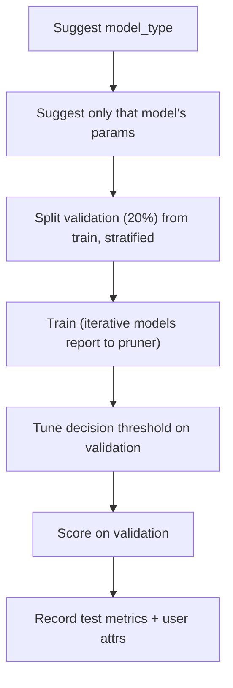

The optimization engine (`backend/tuners/optimizer.py`, the `Optimizer` class) is an Optuna wrapper tuned for the realities of comparing quantum and classical classifiers. This page focuses on *why* it is built the way it is.

## Conditional categorical search space

A naive multi-model search would declare every hyperparameter of every model up front and let the sampler explore the union. QuOptuna does the opposite: the objective **first suggests `model_type`, then suggests only that model's relevant parameters** (defined by `MODEL_PARAM_KEYS` in `backend/models.py`).

The reason is statistical. TPE (Tree-structured Parzen Estimator) builds a probabilistic model of the search space. If irrelevant parameters — say, a kernel's bandwidth while a variational model is selected — are always present, they pollute that model with meaningless dimensions and dilute its signal. Conditional suggestion keeps each model's sub-space clean, so TPE learns useful structure faster.

:::note
Grid mode is the exception: it keeps a static, flat product of all parameters because a grid search has no learned model to protect.
:::

## Samplers vs pruners

These are two orthogonal knobs:

- **Samplers** decide *which* configuration to try next: `tpe` (default, model-based), `random`, or `grid` (exhaustive).
- **Pruners** decide whether to *stop* a running trial early: `asha` (SuccessiveHalving, default), `hyperband`, or `none`.

Pruning only helps models that train iteratively. **JAX-trained variational (quantum) models** report intermediate values through a per-step callback — the pruner treats report indices as resource units and the intermediate metric is f1, accuracy, or neg_loss. **Kernel and classical models have no training steps**, so they always train to completion regardless of the pruner.

## A single trial

## Scoring on a validation split

Every trial is scored on a **validation split carved from the training data (20%)**, not on the test set. This is deliberate: if the optimizer selected configurations by their test performance, it would be tuning *to* the test set, and the final reported test metric would be optimistically biased. Holding the test set out of selection keeps it an honest estimate.

Splits are **stratified** so class proportions are preserved — important for imbalanced data and for the small validation slice. For binary tasks the engine also runs **decision-threshold tuning** (a 19-point grid) on that validation split, so the reported score reflects the best operating point rather than a fixed 0.5 cutoff.

## FAILED-trial isolation

Search spaces spanning quantum and classical models inevitably contain configurations that error out. The study runs with `catch=(Exception,)`, so a bad config becomes a single **FAILED trial** instead of aborting the whole study. The search continues, and per-trial user attrs still record what happened — training_time, n_steps, batch_size, pruned flags, and test metrics.

## Binary vs multiclass

Task handling lives in `backend/task_type.py` (`TaskSpec`):

- **Binary** uses labels `{-1, +1}` and binary F1, plus the threshold tuning above.
- **Multiclass** uses codes `0..K-1`, is scored with **macro-F1**, and wraps variational models in a **One-vs-Rest** scheme (`backend/base/pennylane_models/ovr.py`) so inherently binary quantum classifiers extend to K classes.

## Device and training

Quantum circuits run on PennyLane's `default.qubit` or `lightning.qubit` devices, and variational training is **JAX-based** — which is what makes the per-step pruning reports (and thus early stopping) possible.

## Next steps

- [The workflow engine](/explanation/workflow-engine/)
- [Architecture](/explanation/architecture/)
- [Feature overview](/explanation/features/)
