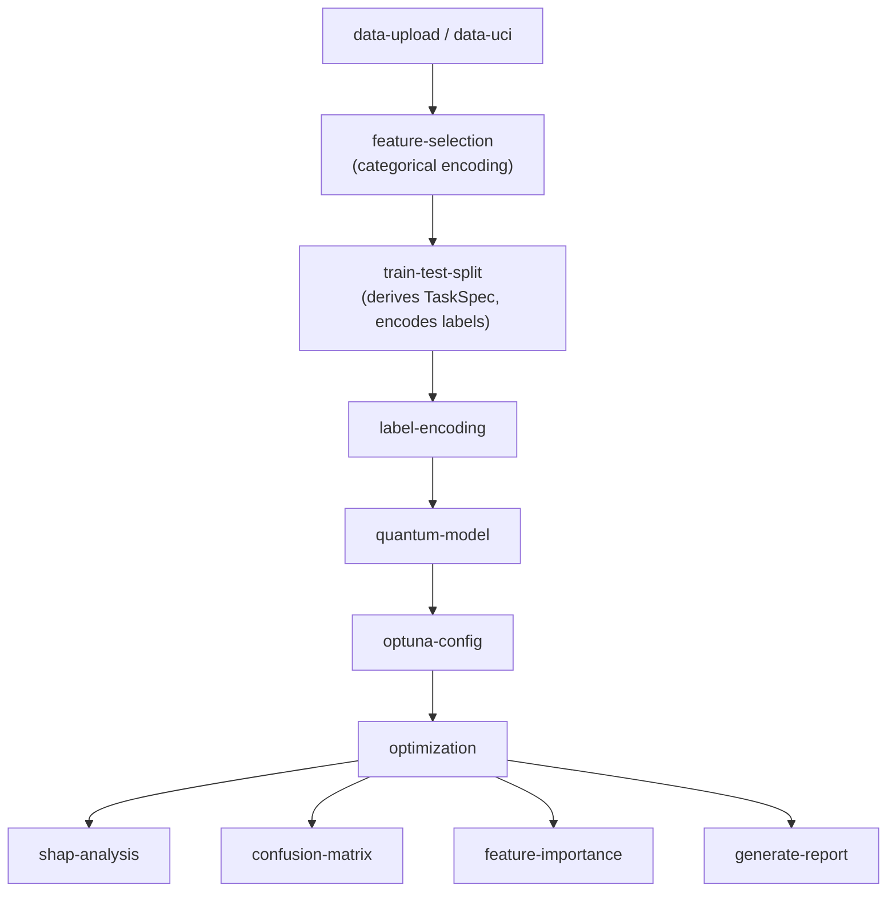

Every QuOptuna run — whether launched from the wizard or the CLI — is represented internally as a **node graph** and executed by a single component: `WorkflowExecutor` (`server/services/workflow_service.py`). This page explains that DAG and why one shared executor matters.

## One pipeline, two front-ends

The guided 6-step wizard and the headless CLI look very different to a user, but they do not implement separate pipelines. Both construct the same workflow graph (built by `build_workflow` in the optimize router) and hand it to the same executor. The wizard and CLI are just two ways of assembling the same nodes.

The payoff is consistency: a run configured in the UI and the equivalent run scripted on the CLI take the identical execution path, so results are reproducible across the two entry points and there is only one code path to maintain.

## The node graph

`WorkflowExecutor` **topologically sorts** the nodes and executes them in dependency order. The sequence flows from ingestion through preparation, optimization, and optional analysis:

## What the nodes do

- **`data-upload` / `data-uci`** — ingest data from an uploaded CSV or a UCI dataset.
- **`feature-selection`** — applies categorical encoding and selects the working feature set.
- **`train-test-split`** — the pivotal preparation step: it derives the `TaskSpec` (binary vs multiclass, favorable class, metrics) and encodes labels accordingly.
- **`label-encoding`** — finalizes label representation for the chosen task type.
- **`quantum-model`** and **`optuna-config`** — declare the candidate models and the search configuration (sampler, pruner, budget, fairness mode).
- **`optimization`** — runs the actual Optuna study through the engine.
- **`shap-analysis` / `confusion-matrix` / `feature-importance` / `generate-report`** — optional post-run analysis and reporting nodes, only executed when requested.

:::note
The analysis nodes are optional branches off `optimization`. A minimal run can stop at the study; a full run continues into SHAP, confusion matrices, and an LLM-generated report.
:::

## Why a DAG

Modeling the run as a graph rather than a fixed script makes dependencies explicit — the executor can order nodes correctly no matter how a given run is assembled, and optional analysis steps attach cleanly without reshuffling the core pipeline. It also gives the UI and CLI a shared, inspectable structure to drive.

## Next steps

- [How the optimization engine works](/explanation/optimization-engine/)
- [Architecture](/explanation/architecture/)
- [Feature overview](/explanation/features/)
