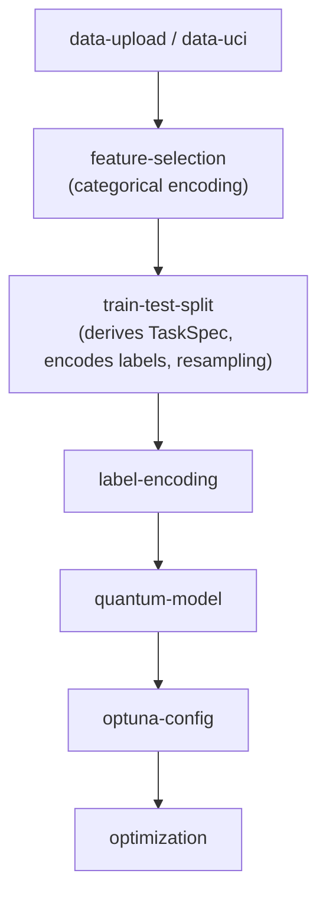

Every QuOptuna run — whether launched from the wizard or the CLI — is represented internally as a **node graph** and executed by a single component: `WorkflowExecutor` (`server/services/workflow_service.py`). This page explains that DAG and why one shared executor matters.

## One pipeline, two front-ends

The guided 6-step wizard and the headless CLI look very different to a user, but they do not implement separate pipelines. Both construct the same workflow graph (built by `build_workflow` in `server/api/v1/optimize.py`; the CLI reaches it through `server/services/headless.py`) and hand it to the same executor. The wizard and CLI are just two ways of assembling the same nodes.

The payoff is consistency: a run configured in the UI and the equivalent run scripted on the CLI take the identical execution path, so results are reproducible across the two entry points and there is only one code path to maintain.

## The node graph

`WorkflowExecutor` **topologically sorts** the nodes and executes them in dependency order. The graph that `build_workflow` produces is a linear chain from ingestion through preparation to optimization:

```mermaid
flowchart TD
  A["data-upload / data-uci"] --> B["feature-selection<br/>(categorical encoding)"]
  B --> C["train-test-split<br/>(derives TaskSpec, encodes labels, resampling)"]
  C --> D["label-encoding"]
  D --> E["quantum-model"]
  E --> F["optuna-config"]
  F --> G["optimization"]
```

## What the nodes do

- **`data-upload` / `data-uci`** — ingest data. Uploaded CSVs, bundled datasets and UCI loads are all registered in the `dataset_registry` with a persisted file, so `build_workflow` emits `data-upload` pointing at that file; `data-uci` is only the fallback for an unregistered UCI dataset id.
- **`feature-selection`** — applies categorical encoding and selects the working feature set.
- **`train-test-split`** — the pivotal preparation step: it derives the `TaskSpec` (binary vs multiclass, favorable class, metrics), encodes labels accordingly, carves the validation split and applies the optional class-imbalance `resampling` (`none` / `oversample` / `undersample`) to the inner training portion, resampling the sensitive column in lockstep.
- **`label-encoding`** — finalizes label representation for the chosen task type.
- **`quantum-model`** and **`optuna-config`** — declare the candidate models and the search configuration (sampler, pruner, budget, device, fairness mode).
- **`optimization`** — runs the actual Optuna study through the engine. `build_workflow(..., include_optimize=False)` omits this node to re-derive the data-prep outputs without running trials; analysis uses this to rehydrate a run after a backend restart.

:::note
The executor also understands `shap-analysis`, `confusion-matrix`, `feature-importance` and `generate-report` node types, but `build_workflow` does not add them. In the wizard, post-run analysis runs as a separate background job through the `/api/v1/analysis` endpoints (see [Analysis pipeline](/explanation/analysis-pipeline/)); the CLI calls `build_xai` directly after the workflow finishes.
:::

## Why a DAG

Modeling the run as a graph rather than a fixed script makes dependencies explicit — the executor can order nodes correctly no matter how a given run is assembled, and stages can be added or dropped (as rehydration does with `optimization`) without reshuffling the rest of the pipeline. It also gives the UI and CLI a shared, inspectable structure to drive.

## Next steps

- [How the optimization engine works](/explanation/optimization-engine/)
- [Architecture](/explanation/architecture/)
- [Feature overview](/explanation/features/)
